<p align="center">
  <a href="README.md">English</a> ·
  <a href="README.ko.md">한국어</a> ·
  <a href="README.zh-CN.md">简体中文</a> ·
  <b>日本語</b>
</p>

<p align="center">
  
</p>

<p align="center">
  <a href="https://github.com/alexgreensh/token-optimizer/releases/latest"></a>
  <a href="https://github.com/alexgreensh/token-optimizer/commits/main"></a>
  <a href="https://github.com/alexgreensh/token-optimizer"></a>
  <a href="https://github.com/alexgreensh/token-optimizer/tree/main/openclaw"></a>
  <a href="https://github.com/alexgreensh/token-optimizer/tree/main/opencode"></a>
  <a href="https://github.com/alexgreensh/token-optimizer/blob/main/docs/codex.md"></a>
  <a href="https://github.com/alexgreensh/token-optimizer/tree/main/hermes"></a>
  <a href="https://github.com/alexgreensh/token-optimizer/blob/main/docs/copilot.md"></a>
</p>
<p align="center">
  
  
  
  
  
  
</p>
<p align="center">
  
  
  
  
  <a href="https://github.com/alexgreensh/token-optimizer/blob/main/LICENSE"></a>
  <a href="https://github.com/alexgreensh/token-optimizer/stargazers"></a>
  <a href="https://github.com/alexgreensh/token-optimizer/commits/main"></a>
  <a href="https://linkedin.com/in/alexgreensh"></a>
</p>
<p align="center">
  <a href="https://github.com/sponsors/alexgreensh"></a>
</p>

<h2 align="center">無駄にしているトークンを削る。失うはずだった仕事を残す。</h2>

<p align="center"><em>バックグラウンドで自動的に動きます。いつも通り作業を続けてください。全体像が欲しいときに監査を実行します。</em></p>

<p align="center">
  <a href="https://alexgreensh.github.io/token-optimizer/"></a>
  <a href="https://alexgreensh.github.io/token-optimizer/start/quickstart/"></a>
</p>

## 30秒バージョン

Token Optimizerは、AIコーディングアシスタントが無駄にするトークンを削り、セッションと圧縮(compaction)をまたいで仕事を生かし、毎ドルがどこに行ったかをライブダッシュボードで示します。**ほとんどは自動で動きます。インストールして監査を一度実行すれば、あとはフックが処理します。**

**なぜHeadroomやRTKで済ませないのか?** どちらもコマンド出力を圧縮しますが、それはコンテキストの15〜25%しかカバーしません。Token Optimizerはそれに加えて残り75%をカバーします:膨張した設定、未使用のスキル、古いメモリ、圧縮ロス、モデルの誤ルーティング、振る舞いの無駄。すべての節約はキャッシュセーフで測定されます。ダッシュボードは毎セッション後に自動更新されます。

**Claude Code**(CLIとVS Code)、**OpenCode**、**OpenClaw**、**Codex**、**Hermes**、**GitHub Copilot**で動作します。WindsurfとCursorがロードマップの次です。

<p align="center">
  
</p>

## インストール

**Claude Code(推奨):**

```
/plugin marketplace add alexgreensh/token-optimizer
/plugin install token-optimizer@alexgreensh-token-optimizer
```

その後Claude Codeで: `/token-optimizer`

> **インストール後に自動更新を有効にしてください。** Claude Codeはサードパーティのマーケットプレースをデフォルトで自動更新オフで配布します。`/plugin` → **Marketplaces**タブ → `alexgreensh-token-optimizer`を選択 → **Enable auto-update**。一回限り、10秒です。
>
> インストール後、`/token-optimizer`を一度実行してフックを設定してください。それ以降はすべて自動で動きます:圧縮、チェックポイント、品質スコア、ダッシュボード更新。監査が欲しいとき以外、コマンドを再実行する必要はありません。

<details>
<summary><b>その他のプラットフォームとインストール方法</b></summary>

**Codex:**
```bash
codex plugin marketplace add alexgreensh/token-optimizer
```
その後Codex TUIで: `/plugins`からToken Optimizerをインストール。[`docs/codex.md`](docs/codex.md)を参照。

**OpenCode:** `opencode.json`の`plugin`配列に`token-optimizer-opencode`を追加:
```jsonc
{ "$schema": "https://opencode.ai/config.json", "plugin": ["token-optimizer-opencode"] }
```
[`opencode/README.md`](opencode/README.md)を参照。

**OpenClaw:**
```bash
openclaw plugins install github:alexgreensh/token-optimizer
```
[`openclaw/README.md`](openclaw/README.md)を参照。

**Hermes:**
```bash
git clone https://github.com/alexgreensh/token-optimizer.git
token-optimizer/install.sh --hermes
```
[`hermes/README.md`](hermes/README.md)を参照。

**GitHub Copilot:**
```bash
git clone --depth 1 https://github.com/alexgreensh/token-optimizer.git
cd token-optimizer
bash install.sh --copilot
```
[`docs/copilot.md`](docs/copilot.md)を参照。

**macOS/Linuxスクリプトインストール(プラグインの代替):**
```bash
tmp="$(mktemp -d)"
release_json="$(curl -fsSL https://api.github.com/repos/alexgreensh/token-optimizer/releases/latest)"
tag="$(python3 -c 'import json,sys; print(json.load(sys.stdin)["tag_name"])' <<<"$release_json")"
git clone --branch "$tag" --depth 1 https://github.com/alexgreensh/token-optimizer.git ~/.claude/token-optimizer
bash ~/.claude/token-optimizer/install.sh
rm -rf "$tmp"
```

**Windowsユーザー:** プラグインインストールのみ使用してください。Windowsで`install.sh`を実行しないでください。`EBUSY`エラーが出たら、すべてのClaude CodeとGit Bashウィンドウを閉じ、残った`git.exe`プロセスをkillし、`C:\Users\<you>\.claude\token-optimizer`と`C:\Users\<you>\.claude\plugins\marketplaces\alexgreensh-token-optimizer`を削除してから再試行してください。

**`install.sh`が`$'\r': command not found`で失敗する場合**(LF強制前に作られたクローンがスクリプトをCRLFに変換した)、キャリッジリターンを一度取り除いて再実行してください。リポジトリは新しいクローンでこれを防ぐ`.gitattributes`を同梱するようになりました:
```bash
sed -i 's/\r$//' ~/.claude/token-optimizer/install.sh
# すでにリポジトリがある? 改行をその場で再正規化:
git -C ~/.claude/token-optimizer add --renormalize . && git -C ~/.claude/token-optimizer checkout -- .
```

</details>

<details>
<summary>アンインストール</summary>

Token Optimizerは付加的で可逆です。すべてのランタイムに、私たちがインストールしたものだけを削除し、あなた自身のフック、設定、セッションデータをそのまま残すクリーンなアンインストールがあります。ランタイム別の完全な手順は **[docs/uninstall.md](docs/uninstall.md)** にあります。

最短経路(Claude Codeプラグインインストール):

```
/plugin uninstall token-optimizer@alexgreensh-token-optimizer
```

</details>

## 何が得られるか

**毎セッション自動で動き、あなたは何もしない:**

- 🔄 **スマート圧縮(Smart Compaction)**: 自動圧縮前にチェックポイント、後に復元
- 🗄️ **セッション継続性(Session Continuity)**: セッション間ヒント、コールドリジューム、チェックポイント採点
- 📦 **アクティブ圧縮(Active Compression)**: 9機能、すべてデフォルトオン(delta diff、スケルトン、bash/検索圧縮、リーン出力ナッジ、品質ナッジ、ループ検出、アクティビティモード、意思決定抽出)
- 📊 **品質スコアリング(Quality Scoring)**: 7シグナル、リアルタイム、S〜Fの文字等級
- 🗃️ **セッションデータベース(Session Database)**: SQLite、15テーブル、完全な監査証跡、ゼロネットワーク
- 🔍 **プログレッシブ開示(Progressive Disclosure)**: 大きな出力はアーカイブ、要求時に展開
- 🧠 **コンテキストインテル要約(Context Intel Digest)**: 圧縮後の再読込なしの再位置づけ
- 🔀 **モデルルーティングナッジ(Model Routing Nudges)**: タスクに合ったティアへ誘導

**あなたが求めたとき:**

- 🩺 `/token-optimizer`: ガイド付き修正を伴う完全監査
- 📈 `/token-coach`: 具体的な修正を伴う30日トレンド分析
- ⚡ `quick`: 10秒ヘルスチェック
- 🎯 `route`: お金を使う前に、このタスクが実際に必要とするモデルとeffort
- 🔧 `doctor`: インストールチェック
- 💰 `savings`: ドル節約レポート
- 📋 `report`: コンポーネント別トークン内訳
- 🌐 `dashboard`: 完全ダッシュボードを開く
- 📝 `memory-review`: MEMORY.md構造監査
- 📂 `expand`: アーカイブされたツール結果を取得
- 🔙 `resume-lean`: コールドセッションを再開

インストールして`/token-optimizer`を一度実行すれば、あとはすべて自動で動きます。

## 何が違うのか

ほとんどのトークンツールはコマンド出力を圧縮します。それはコンテキストの15〜25%をカバーします。残り75%は手つかずです。

**圧縮カバレッジ。** Headroom、RTK、JFrog Boostはbashとコマンド出力を圧縮します。Token Optimizerは出力スタックの8つの面を圧縮します。状態: 🟢 サポート、🟡 部分、🔴 非サポート。

| 圧縮面 | Token Optimizer | Headroom | RTK | Boost |
|---|---|---|---|---|
| **Bash / コマンド出力**(git、テスト、lint、ビルド、ログ) | 🟢 22パターンファミリにわたる111コマンド、クレデンシャルセーフ;pytest実行で564 → 115トークン | 🟢 SmartCrusher、CodeCompressor、Kompress-v2 | 🟢 100以上のフィルタ | 🟢 コマンド認識フィルタ |
| **検索 / grep出力** | 🟢 トップヒットとカウント;500行 → 20 | 🔴 | 🔴 | — |
| **表形式 / JSON出力**(jq、yq、csvtool、mlr) | 🟢 値保存の列形式 | 🟢 SmartCrusher | 🔴 | — |
| **ファイル再読込、deltaモード** | 🟢 diffのみ;2,000トークン再読込 → ~50 | 🔴 | 🔴 | — |
| **ファイル再読込、構造マップ** | 🟢 シグネチャとimportのスケルトン;720KB → 250トークン | 🔴 | 🔴 | — |
| **大きなツール結果**(4K文字超) | 🟢 ディスクにアーカイブ、要求時に展開可能 | 🔴 | 🔴 | — |
| **モデル出力の冗長さ** | 🟢 リーン出力ナッジ、キャッシュセーフ(節約は推定、計測ではない) | 🔴 | 🔴 | 🔴 |
| **構造的コンテキスト**(設定、スキル、MCP、メモリ) | 🟢 コンポーネント別監査、各ソースを採点 | 🔴 | 🔴 | 🔴 |

RTKとBoostは最初の面に到達します。Headroomは最初と3番目に到達します。Token Optimizerは8つすべてをカバーし、圧縮の周りで何が起きるかへ進み続けます:

- **1つではなく3種類の無駄。** 構造的(膨張した設定、未使用スキル、古いメモリ)、ランタイム(冗長な出力、再読込)、振る舞い(モデル誤ルーティング、キャッシュ期限、再試行ループ)。[それぞれの仕組み →](https://alexgreensh.github.io/token-optimizer/features/active-compression/)
- **節約は圧縮を生き残る。** 自動圧縮前にチェックポイント、後に復元。これがないと、圧縮の節約は圧縮が発火した瞬間に消えます。
- **役に立ったか測る。** 前後のトークン差分、4つの価格ティアにわたるドル節約、劣化を追跡する品質スコア。単なる「圧縮した」ではありません。
- **ゼロのベースラインオーバーヘッド。** 外部プロセス、コンテキストに常時オンの指示なし、MCPサーバーなし、依存関係なし、テレメトリなし。

<p align="center">
  
</p>

この10行は、Token Optimizerがその行で唯一🟢の行です: 圧縮を超えて生き残るもの、そしてどの圧縮器も探さない無駄。圧縮の仕組み、コストと安全性、そして私たちが負ける2行は折りたたみの後ろにあります。

|  | Token Optimizer | Headroom | RTK | Boost | context-mode | `/context` |
|---|---|---|---|---|---|---|
| 圧縮生き残り | 🟢 プログレッシブチェックポイント、復元、ツール出力要約 | 🔴 | 🔴 | — | 🟡 セッションガイドのみ | 🔴 |
| セッション継続性 | 🟢 セッション間ヒント、コールドリジューム、チェックポイント採点 | 🔴 | 🔴 | — | 🟡 セッションガイド | 🔴 |
| 構造的無駄の監査 | 🟢 コンポーネント別の深掘り(CLAUDE.md、スキル、MCP、メモリ) | 🔴 | 🔴 | 🔴 | 🔴 | 🟡 要約のみ |
| CLAUDE.mdとMEMORY.mdの健康 | 🟢 8監査器 + アテンションカーブ採点 | 🔴 | 🔴 | 🔴 | 🔴 | 🔴 |
| モデルルーティングと振る舞いのコーチング | 🟢 12検出器、サブエージェントコスト内訳、アンチパターン | 🔴 | 🔴 | — | 🔴 | 🟡 基本的な提案 |
| 過去トレンド分析 | 🟢 30日トレンド、品質/コスト/キャッシュ/期間の相関、モデル切替検出 | 🔴 | 🔴 | — | 🔴 | 🔴 |
| コンテキスト品質スコア | 🟢 等級付き7シグナル品質スコア | 🔴 | 🔴 | — | 🔴 | 🟡 容量%のみ |
| ループと空転の検出 | 🟢 トークンを燃やす前に振る舞いループを捕捉 | 🔴 | 🔴 | — | 🔴 | 🔴 |
| 圧縮が役立ったか測定 | 🟢 ローカルテレメトリ、前後トークン、ドル節約 | 🔴 | 🟡 `rtk gain`(トークンカウントのみ) | 🟡 `boost report`、ベンダー側 | 🔴 | 🔴 |
| フリートレベルのクロスエージェント分析 | 🟢 | 🔴 | 🔴 | — | 🔴 | 🔴 |

<details>
<summary><b>残り13行を表示</b>(圧縮の仕組み; コスト、安全性と到達; チューニング、証明とインストール)</summary>

|  | Token Optimizer | Headroom | RTK | Boost | context-mode | `/context` |
|---|---|---|---|---|---|---|
| コマンド書き換え不要 | 🟢 フック接続、自動発火 | 🟢 透過プロキシ | 🟢 フックベースの書き換え | 🟢 `boost init`が対応エージェントを接続; ターミナル使用はプレフィックス可能 | 🟡 フック対応プラットフォームで自動 | N/A ネイティブコマンド |
| 完全なオリジナルが復元可能 | 🟢 圧縮前に生をアーカイブ、`expand`で取得; 失敗は圧縮されない | 🟢 可逆な取得 | 🟡 コマンド失敗時に完全出力を保存 | 🟢 ベンダーがコマンド出力復元を文書化 | — | N/A 圧縮しない |
| カスタムコマンドフィルタの登録 | 🔴 組み込みコマンドセット; ユーザーフィルタAPIなし | — | 🟢 カスタムTOMLフィルタ | 🟢 TOMLフィルタ | — | N/A |
| ユーザー調整可能な設定 | 🟢 92のコード参照`TOKEN_OPTIMIZER_*`名、ユーザー向けと内部制御に明示分割; 追加的許可リスト; `.contextignore` | 🟢 文書化された設定 | 🟢 `config.toml`と環境制御 | 🟢 フィルタTOML | 🟢 文書化された設定 | N/A |
| キャッシュセーフ | 🟢 既存のコンテキストプレフィックスを変更しない | 🟡 プロキシモードが進行中を書き換え | 🟢 pre-shellのみ | 🟢 pre-shellのみ | 🟡 MCPオーバーヘッド | 🟢 |
| ゼロベースラインコンテキストオーバーヘッド | 🟢 外部プロセス、コンテキスト注入なし | 🔴 指示を注入 | 🟢 シェルレベルのみ | 🟢 シェルレベルのみ | 🔴 MCPサーバーオーバーヘッド | 🟢 ネイティブ |
| ゼロランタイム依存 | 🟢 純標準ライブラリ(Python/TypeScript) | 🟡 Python + Rust + オプションモデル | 🟢 単一Rustバイナリ | 🟢 単一バイナリ | 🟡 SQLiteアダプタが必要 | 🟢 N/A |
| ゼロテレメトリ | 🟢 マシンから何も出ない | 🟡 `HEADROOM_TELEMETRY`オプトイン、デフォルトオフ | 🟡 オプトイン | 🔴 呼び出されたコマンド、コマンド引数、終了コード、期間、CI属性、IPを収集 | 🟡 様々 | 🟢 |
| マルチプラットフォーム | 🟢 Claude Code、VS Code、Codex、OpenClaw、OpenCode、Hermes、Copilot | 🟢 Claude Code、Cursor、Codex、Aider、Copilot | 🟢 15統合 | 🟡 Cursor、Claude Code、Copilot、Codex CLI | 🟢 17統合 | 🔴 Claude Codeのみ |
| タスク別のモデルとeffortの助言 | 🟢 `route`がお金を使う前にタスクを計量 | — | — | — | — | — |
| Keep-Warm(キャッシュTTLリフレッシュ) | 🟢 キャッシュ期限前のオプトインping、トリップワイヤー自動オフ | 🔴 | 🔴 | — | 🔴 | 🔴 |
| エンドツーエンドのタスク結果ベンチマーク | 🔴 出力トークンA/Bのみ | — | — | 🟢 ベンダーが同じ合格率と約12%低コストでTerminal-Bench 2.0を報告 | — | N/A |
| 署名とチェックサム検証インストール | 🟢 リリースごとの`CHECKSUMS.sha256`、インストール時に検証、CI強制 | — | — | 🔴 インストーラはチェックサムも署名も検証しない | — | N/A |

</details>
ダッシュ(em dash)は、その能力が2026-07-26のソース監査で第一資料から検証されなかったことを意味します; 能力が不在だと主張するものではありません。Boostの「pre-shell」と「shell-level」セルは文書化されたラッパー形式(`boost <command>`)に由来します; `boost init`がエージェントを接続するのに使う仕組みは第一資料に記述されていません。Token Optimizerの圧縮の主張は実際のセッションと、あなたが自分で実行できる87フィクスチャスイートに対してテストされています。**[完全なベンチマーク方法論と結果 →](BENCHMARK.md)**

<p align="center">
  <a href="https://alexgreensh.github.io/token-optimizer/reference/comparison/"></a>
</p>

## ダッシュボード


1つのHTMLページ、SessionEndフック経由で毎セッション後に自動再生成、手動トリガー不要。ブックマーク可能なURL `http://localhost:24842/token-optimizer`はオプトインです: `python3 skills/token-optimizer/scripts/measure.py setup-daemon`を実行してローカルサーバーを起動した後にのみ動作します。それまでは、`measure.py dashboard`が`  Dashboard: `行に出力するファイルパスを開いてください。

ターンごとのトークン内訳、4つの価格ティアにわたるコスト、TTLミックスとヒット率を伴うキャッシュ分析、すべてのセッションに重ねられた品質スコア、サブエージェントコスト内訳、4つの重複しないプールを持つ節約トラッカー。インストール後ゼロ設定。[完全なダッシュボードドキュメント →](https://alexgreensh.github.io/token-optimizer/features/dashboard/)

## 何を節約するか

節約は2つのティアで追跡される、重複しない4つのプールから来ます:

| プール | カバーするもの |
|---|---|
| モデルルーティング + キャッシング | より軽いプレフィックス、より軽いモデルミックス、キャッシュ書き込みをルーティングのレバーとして |
| サブエージェントルーティング | サイドチェーンコスト最適化(Claude Codeのみ) |
| 圧縮加戻し | deltaモード、構造マップ、bash/検索圧縮で削除されたトークン |
| リーン出力加戻し | 簡潔ナッジのために生成されなかった出力トークン |

**2つの数字、別々に保持:**

- **計測済み(~$313/月)**、アクションごとに記録。Token Optimizerがより軽いモデルに切り替え、大きな結果を切り詰め、繰り返し読込をスキップするたびに足します: より賢い習慣 ~$260/月、作業中の圧縮 ~$53/月。これはイベントごとに計量されたスライスなので、より小さく正確です。
- **全体像(~$1,877/月、~18%)**、完全な反事実。Token Optimizer以前のやり方(~95% Opus)で作業していたら、~$10,585/月を払っていたところが今は~$8,708/月です。その差はほとんどより軽いモデルミックス(95% Opusから60%へ、メインルーティング + キャッシングで~$1,076/月)、より安いサブエージェント(~$741/月)、計測された圧縮加戻し(~$60/月)から来ます。

これらの数字は合算されません。計測済みは硬い領収書のある床です。全体像はあなたの凍結されたToken Optimizer以前のベースラインに対して価格設定されたモデルです。[完全な方法論を見る →](BENCHMARK.md)

<p align="center">
  
</p>

30日間にわたる684セッションに基づく(2026-06-15終了スナップショット)、凍結されたToken Optimizer以前のベースライン(~95% Opus)に対して価格設定。あなたの数字はあなた自身のものです。[方法論を見る →](BENCHMARK.md)

<p align="center">
  
</p>

## アクティブ圧縮

コンテキストを能動的に減らす9機能、すべてデフォルトオン、すべて自動、すべてダッシュボードまたはCLIからトグル可能。

内部では、**PreToolUseフック**がすべてのReadとBash呼び出しをコンテキストに入る前にインターセプトします。ファイルがすでに読まれていれば、diffだけが戻ります。コードファイルの再読込なら、構造スケルトンが完全内容を置き換えます。CLIコマンドなら、出力が圧縮されます。**PostToolUseフック**は完全なオリジナルをディスクにアーカイブし、圧縮イベントをSQLiteに記録します。何も失われず、すべてが取得可能です。**あなたは何もしない。フックがすべて処理します。**



| 機能 | 何をするか | 節約 |
|---|---|---|
| Deltaモード | 再読込は変化したものだけを返す | 再読込で ~20% |
| 構造マップ | 変更のないファイル再読込は構造スケルトンを返す | ~30%(ファイルごとに最大99%) |
| Bash圧縮 | CLI出力を要点に凝縮 | ~10% |
| 検索圧縮 | grep/web結果をトップヒット + カウントに凝縮 | ~15% |
| リーン出力ナッジ | コンテキストが埋まる時モデルを簡潔出力に誘導 | 推定10-15%; 反事実的には計測されない |
| 品質ナッジ | コンテキスト品質が落ちた時に警告 | 圧縮ロスを防ぐ |
| ループ検出 | トークンを燃やす前に再試行ループを捕捉 | ループごとに計測 |
| アクティビティモード | セッションフェーズに合わせて圧縮を適応 | 意思決定ロスを防ぐ |
| 意思決定抽出 | 圧縮をまたいで意思決定を保存 | 意思決定ドリフトを防ぐ |

ダッシュボードのManageタブ、CLI(`measure.py v5 enable|disable <feature>`)、または環境変数からトグル。`v5`動詞は現在の機能を制御するレガシーコマンド名です。

[各機能の仕組みを読む →](https://alexgreensh.github.io/token-optimizer/features/active-compression/)

<details>
<summary><b>機能別の詳細</b></summary>

### Deltaモード

AIが編集後にファイルを再読込すると、Read呼び出しはdiffだけを返します。実際のセッションの65%以上のRead呼び出しは再読込です。2,000トークンのファイル再読込が50トークンのdiffになります。



無効化: `TOKEN_OPTIMIZER_READ_CACHE_DELTA=0`

### 構造マップ

Claudeがすでに見たコードファイルを再読込すると、Read呼び出しはブロックされ、構造サマリに置き換えられます: 関数シグネチャ、クラス階層、import。720KBのPythonファイル(180,000トークン)が250トークンのスケルトンになります。

無効化: `TOKEN_OPTIMIZER_READ_CACHE_MODE=shadow`

### 初回読込スケルトン

履歴検証コホートでの大型**コード**ファイル(PythonまたはTypeScript、16KB〜256KB)の**最初の**読込で、Readは完全ファイルの代わりに構造スケルトン(シグネチャ/import)を返し、1行の通知と共に、完全内容は常に1歩のところにあります: `expand <key>`、範囲Read(`offset`/`limit`)、または直接Edit。オリジナルはいかなる置換の前にもアーカイブされ、フェイルオープン、アーカイブできない場合は完全ファイルが提供されます。

これは**コードのみ**に適用されます。Markdownや他の散文は初回読込でスケルトン化**されません**(v5.11.27時点): 見出しのみのアウトラインは荷重を担う散文を落とすので、ドキュメントは常に完全に戻ります。ランタイムのトリップワイヤーは、ライブ編集率が上がるとコードコホートを計測のみに自動降格します。

提供の無効化(計測は保持): `TOKEN_OPTIMIZER_FIRST_READ_ACTIVE=0`。完全に無効化: `TOKEN_OPTIMIZER_FIRST_READ_SHADOW=0`。両方は`measure.py v5 status`とダッシュボードのManageタブでも表示・トグル可能です。

### Bash出力圧縮

一般的なCLIコマンドを書き換えて圧縮サマリを返します。lint、ログ末尾、tree、docker pull、長いリスト、ビルド出力、テストランナーをカバー。564トークンのpytest出力が115トークンになります。



無効化: `TOKEN_OPTIMIZER_BASH_COMPRESS=0`

### 検索結果圧縮

AIがgrep、rg、または長い結果リストを返すweb検索を実行すると、出力はトップヒットとカウントに凝縮されます。500行のgrep結果が20行とサマリになります。

無効化: `TOKEN_OPTIMIZER_BASH_COMPRESS=0`(検索圧縮はbash圧縮の一部です; 別のスイッチはありません)

### リーン出力ナッジ

コンテキストが25%を超えて埋まると、短いナッジがモデルに深く推論しつつ可視出力は簡潔に保つよう伝えます。充填が唯一の条件で、品質はもはやこれをゲートしないため、普通の健全なセッションもナッジを受け取ります、長く退化したものだけでなく。節約は**10-15%と推定され、計測されません**: 反事実(ナッジなしでモデルが何を書いたか)は観察できないため、Token Optimizerはこれを推定ティアで報告し、計測された節約に折り込みません。キャッシュセーフ: `additionalContext`として注入、既存のプレフィックスを変更しない。

今日オン/オフのスイッチはありません(`v5`機能ではない)。`TOKEN_OPTIMIZER_VERBOSITY_MIN_FILL`(デフォルト`25`)でトリガーポイントを調整。

### 品質ナッジ

コンテキスト品質をリアルタイムで監視。スコアが15ポイント以上下がるか60を下回ると、インラインノートがコンテキストに入ります。Claudeは次のターンでそれを見て警告を浮上させるか振る舞いを調整します。5分のクールダウン、セッションあたり最大3回。

無効化: `TOKEN_OPTIMIZER_QUALITY_NUDGES=0`

### ループ検出

AIが再試行ループに囚われているのを捕捉。最後の4つのユーザーメッセージと最後の5つのツール結果を類似度で比較します。信頼度 ≥0.7で発火、セッションあたり2ノートの上限。実際のループターン内容から計測された節約。

無効化: `TOKEN_OPTIMIZER_LOOP_DETECTION=0`

### アクティビティモード検出

最後の10回のツール呼び出しを使ってセッションを5つのモード(コード、デバッグ、レビュー、インフラ、一般)のいずれかに分類します。このモードは圧縮ガイダンスに入り、PRESERVE/DROPの優先順位があなたのしていることに適応します。

### 意思決定抽出

ツール出力から意思決定ステートメントをリアルタイムで検出し、セッションデータベースに保存します。圧縮時に、これらの意思決定はサマリが逐字保存しなければならないCRITICAL DECISIONSとして注入されます。セッションあたり10の上限。

### 実際の節約を計測

すべての圧縮機能はローカルのSQLiteテーブルに記録されます。マシンから何も出ません。

```bash
python3 measure.py compression-stats --days 30
```

</details>

## セッションデータベース

Token Optimizerが行うすべては2つのローカルSQLiteデータベースで支えられています。マシンから何も出ません。ゼロのネットワーク呼び出し。

<p align="center">
  
</p>

**セッション別DB**(`~/.claude/token-optimizer/snapshots/session-store/<session>.db`)はファイル読込、ツール出力、コマンド出力、キャッシュされた内容、コンテキストインテルイベント、アクティビティログ、意思決定ログ、ヒント提供を追跡する8テーブルを持ちます。フックプロセスからの並行読み書きのためのWALモード。セッションあたり50MBの上限。

**トレンドDB**(`~/.claude/token-optimizer/snapshots/trends.db`)はセッション履歴、日次集計、スキル/モデル/サブエージェント使用、節約イベント、圧縮イベントを追跡する7テーブルを持ちます。O(log n)の結合のためにセッションUUIDでインデックス。これがダッシュボード、コーチモード、30日トレンド分析を駆動します。

すべての圧縮イベント、すべての節約、すべての品質計測はクエリ可能な1行です。ダッシュボードはこのデータの読み取り専用ビューです。`measure.py compression-stats`はSQLクエリです。あなたのデータはあなたのものです。

## プログレッシブ開示

大きなツール結果(>4KB)はディスクにアーカイブされ、短いプレビューと取得ポインタで置き換えられます。完全な出力は圧縮を生き残ります。モデルが必要な時、コマンドの再実行や失われた出力なしに`expand`でオリジナルを引っ張ります。

これは単なる保存ではありません。システムはアーカイブされた結果対再展開された結果の数を追跡するので、折りたたまれたまま残ったネットトークンを見られます。再展開は節約合計から相殺されるので、実際に圧縮されたまま残ったものだけを数えます。

```bash
python3 measure.py expand --list          # アーカイブされたツール結果を一覧
python3 measure.py expand <tool-use-id>   # 特定の結果を取得
```

一部のMCPツールは、メタデータプレビューが要点を損なうような、大きな逐語ペイロードを返すよう*文書化*されています(ソースフェッチャー、ドキュメント検索器)。それらを許可リストに入れて、完全な結果が置換されずにコンテキストに届くようにしてください(まだアーカイブされるので`expand`は動きます)。完全ツール名にマッチする`fnmatch` globのカンマ区切りリストを設定:

`TOKEN_OPTIMIZER_ARCHIVE_EXEMPT_TOOLS="mcp__context7__*,*github_repository_file"`

デフォルトは空です、ツールをオプトインしない限り何も免除されません。

## セッション継続性

圧縮も重要ですが、Token Optimizerが行う最も重要なことは、セッションと圧縮をまたいで仕事を自動的に生かしておくことです。

セッションを終える時、Token Optimizerはあなたの状態をSQLiteにチェックポイントします: アクティブタスク、主要な意思決定、変更されたファイル、gitブランチ、最近の読込。新しいセッションを始める時、プロンプトに対してすべての最近のチェックポイントを採点し、最も関連するものをヒントとして浮上させます。ゼロからではなく、コンテキストと共に再開します。

**自動的に何が起きるか:**

- **セッション間ヒント**: 関連性採点されたチェックポイントが新しいセッション開始時に浮上。ヒントは前のセッションのタスク、意思決定、ファイル、ブランチを含む。すべてRECOVERED DATAとしてフェンス、決して指示ではない。
- **コールドリジュームリーン**: 完全なトランスクリプトコストを払わずに古いセッションを再開。Token Optimizerはチェックポイントからリーンなコンテキストを再構築。LLM呼び出しなし、完全トランスクリプトのコールドリジュームなし。SQLiteからのトークン不要の再構築。
- **ヒントフォロー計測**: 継続性ヒントがファイルパスを浮上しモデルがその後その一つを読むと、Token Optimizerは回避された探索的検索としてクレジット。計測された因果、推測ではない。

```bash
python3 measure.py resume-lean                    # 再開可能なコールドセッションを一覧
python3 measure.py resume-lean <#|session_id> --print  # リーンコンテキストブロックを出力
```

圧縮の節約はセッションが圧縮を生き残る時にのみ定着します。セッション継続性がそれを実現します。

## スマート圧縮

自動圧縮が発火すると、会話の60〜70%が消えます。意思決定、エラー修正シーケンス、エージェント状態、すべて消えます。

Token Optimizerは圧縮前にセッションをチェックポイントし、フック経由でサマリが落としたものを自動的に復元します。また**コンテキストインテル要約**を注入します: モデルがすでに処理した大きなツール出力のヒューリスティックなサマリ(触れたファイルパス、見たエラー、行数)。圧縮後、モデルはすべてを再読込せずに自分が見たものを知ります。

**アクティビティモード検出**は最後の10回のツール呼び出しを使ってセッションをリアルタイムで分類します(コード、デバッグ、レビュー、インフラ、一般)。このモードは圧縮ガイダンスに入り、PRESERVE/DROPの優先順位が汎用ヒューリスティックではなく今あなたのしていることに適応します。

**意思決定抽出**は意思決定ステートメントをツール出力から発生時に捕捉し、セッションDBに保存します。圧縮時に、これらはサマリが逐字保存しなければならないCRITICAL DECISIONSとして注入されます。セッションあたり10の上限。

圧縮の節約はセッションが圧縮を生き残る時にのみ定着します。`git status`でトークンを節約しても、次の自動圧縮がそれを実行させた意思決定を消し去れば役に立ちません。

<p align="center">
  
</p>

<details>
<summary><b>スマート圧縮の仕組み</b></summary>

### プログレッシブチェックポイント

複数の閾値でセッション状態を捕捉: 20%、35%、50%、65%、80%のコンテキスト充填、加上品質が80、70、50、40を下回る時。エージェントファンアウト前と大きな編集バッチ後にもスナップショット。復元時、最も豊かな適格チェックポイントを選択。

### コンテキストインテル要約

圧縮後、Token Optimizerはセッションの最大ツール出力の要約を注入: 触れたファイルパス、検出されたエラー、行数。<30msでヒューリスティックに生成、LLM呼び出しなし。モデルはすべてを再読込せずに再位置づけします。

```bash
python3 measure.py setup-smart-compact    # チェックポイント + 復元フック
```

</details>

## 出力トークン: リーン vs 冗長

出力トークンはあなたのセッションで最も高価な部分です。Opusでは入力トークンの5倍のコストで、キャッシュ読み取りではなく生成ごとに課金されます。簡単な質問への冗長な応答は、決して費やす必要のなかったドルを燃やします。

Token Optimizerは**リーン出力ナッジ**でこれを自動的に処理します。コンテキストが25%を超えて埋まると、短いナッジがモデルに深く推論しつつ可視出力は簡潔に保つよう伝えます。充填が唯一のトリガーで、コンテキスト品質は条件ではありません。削減は**10-15%と推定され、反事実的には計測されない**ため、推定ティアで報告され、計測された節約とは別です。

**仕組み:**

- ナッジは`additionalContext`として注入、既存のプレフィックスを変更しないので、キャッシュは無傷のまま
- コンテキストが埋まりつつある時にのみ発火、十分な余裕がある時ではない
- モデルは依然として問題を考える; より簡潔な可視回答を生成するだけ
- 今日オン/オフのスイッチはない; `TOKEN_OPTIMIZER_VERBOSITY_MIN_FILL`(デフォルト`25`)でトリガーポイントを調整

これは9つのアクティブ圧縮機能の一つで、トークンが最も高価な出力側で節約する機能です。

## 品質スコアリング

品質スコアは2つを追跡します: **リソースヘルス**(退化の崖にどれだけ近いか)と**セッション効率**(あなたのトークンが有用な仕事をしているか)。SからFまでの文字等級がトリアージを即時にします。

コンテキストが埋まるにつれ、品質は下がります。MRCRは256Kと1Mのコンテキスト間で93%から76%に下がります。ウィンドウが埋まるにつれAIは計測可能に馬鹿になります。品質スコアはそれがいつ起きるか正確に示します。


ステータスバーは品質が退化するにつれ色が変わります: 緑、黄、オレンジ、赤。品質が75を下回ると、セッション期間が警告として現れます。実行中のサブエージェントはモデルと経過時間と共に表示されます。


```bash
python3 measure.py setup-quality-bar      # 一回限りのインストール
```

[スコアリングの仕組みを読む →](https://alexgreensh.github.io/token-optimizer/features/quality-signals/)

<details>
<summary><b>品質スコアの詳細</b></summary>

| スコア | シグナル | 意味 |
|--------|--------|----------------|
| **リソースヘルス** | コンテキスト充填、圧縮深度、絶対無駄トークン | 退化の崖にどれだけ近いか |
| **セッション効率** | 古い読込、膨張した結果、意思決定密度、エージェント効率 | セッションが今トークンをうまく使っているか |

| 等級 | 範囲 | 意味 |
|-------|-------|---------|
| **S** | 90-100 | ピーク効率 |
| **A** | 80-89 | 健全、小さな最適化が可能 |
| **B** | 70-79 | 退化が始まっている |
| **C** | 55-69 | 顕著な無駄 |
| **D** | 40-54 | 深刻な問題 |
| **F** | 0-39 | コンテキストが腐敗中、即時の行動が必要 |

**品質バーが消えた?** Claude Codeの`/statusline`を実行するとToken Optimizerのエントリを上書きします。SessionStartが自動復元。新しいセッションを始めれば戻ります。

**永久にオフにしたい?**
```bash
python3 measure.py setup-quality-bar --uninstall
```

</details>

## コーチモード

```
> /token-coach
```

目標を伝えます。正確なトークン節約を伴う、具体的で優先順位付けされた修正を受け取ります。30日間のセッションデータを読み、単一セッションでは示せないものを浮上させます: 品質の下方ドリフト、セッションが長くなること、キャッシュヒット率の低下、セッションあたりコストの上昇。

すべてのインサイトはあなたの実際の数字に基づきます。「短いセッションは68点、長いセッションは60点」は「より短いセッションを検討してください」とは違った響きがあります。コーチモードはまたプロジェクトレベルの最適化機会(決して使わないスキル、熱心にロードするMCPサーバー、キャッシュを壊すCLAUDE.mdパターン)を特定し、将来のセッションがよりリーンに始まるよう直し方を教えます。

[コーチモードについて読む →](https://alexgreensh.github.io/token-optimizer/features/token-coach/)

<details>
<summary><b>コーチモードの詳細</b></summary>

### 検出される過去のパターン

| パターン | 何を検出するか |
|---|---|
| 品質ドリフト | 週ごとの平均品質の低下 |
| セッション期間の這い上がり | セッションが長くなり、コンテキストがより早く埋まる |
| キャッシュ退化 | キャッシュヒット率の低下(およびモデル切替が原因か) |
| 等級分布 | D等級セッションが蓄積しすぎ |
| コスト意識 | セッションあたりコストの上昇、ルーティングの助言付き |
| 期間-品質の相関 | 短いセッションがより高得点、長いものを分割するよう示唆 |
| 圧縮ギャップ | shadowのみの節約がアクティブ圧縮を大きく超過 |
| モデル切替 | 頻繁なセッション途中のモデル切替がプロンプトキャッシュを無効化 |

### 無駄検出器

11の自動検出器があなたのセッションパターンを分析:

| 検出器 | 何を捕捉するか |
|---|---|
| PDF/バイナリ摂取 | コンテキストを消費する大きなファイル |
| Web検索オーバーヘッド | コンテキストにダンプされるweb結果が多すぎる |
| 再試行チャーン | 同じツールをエラーで3回以上再試行 |
| ツールカスケード | 3回以上の連続ツールエラー |
| ルーピング | 繰り返される類似メッセージ |
| 強すぎるモデル | 簡単な編集にOpusを使用 |
| 弱すぎるモデル | 複雑なタスクにHaiku |
| 悪い分解 | モノリシックな500+語のプロンプト |
| 無駄な思考 | 小さな編集に2倍を超える拡張思考 |
| 出力の無駄 | 簡単な操作への冗長な応答 |
| キャッシュ不安定 | プロンプトキャッシュを壊すCLAUDE.mdパターン |

### Keep-Warm

API課金セッション向けのオプトイン機能。プロンプトキャッシュエントリが期限切れになる直前に小さなキャッシュ読み取りpingを発行し、TTLをリフレッシュします。再開時に払う1.25-2倍の再書き込みに対し、プレフィックスの約0.1倍のコスト。pingが自分のコストを賄わなくなるとトリップワイヤーが自動オフ。

```bash
python3 measure.py keepwarm-enable          # オプトイン(API課金のみ)
python3 measure.py keepwarm-report            # 正味節約、支出、トリップワイヤー状態
python3 measure.py keepwarm-disable           # いつでもオプトアウト
```

### フリート監査器

Claude Code、Codex、カスタムトランスクリプト設定を横断スキャンし、アイドル燃焼、モデル誤ルーティング、設定膨張を発見ごとのドル節約と共に見つけます。

### CLAUDE.mdルーティング注入

あなたの実際の使用データからモデルルーティング指示を生成し、CLAUDE.mdに注入します。48時間の陳腐化ガードが古い助言を自動削除。

```bash
python3 measure.py inject-routing --dry-run   # プレビュー
python3 measure.py inject-routing              # 注入
```

</details>

## FAQ

<details>
<summary><b>🔒 コンテキスト品質を劣化させることがありますか?</b></summary>

いいえ。構造的最適化は本当に未使用のコンポーネントのみを削除します。アクティブ圧縮の制御は単一のコマンドまたは環境変数で無効化できます。品質スコアリングシステムが劣化をリアルタイムで追跡します。

</details>

<details>
<summary><b>💾 プロンプトキャッシュを壊しますか?</b></summary>

いいえ。Token Optimizerはすでにコンテキストにある内容には決して触れません。ウィンドウに入る新しい内容と圧縮の境界で動作します。キャッシュプレフィックスは無傷のままで、これは2回節約することを意味します: ターンあたりの入力がより少なく、以降の毎ターンのキャッシュ読み取りがより安く。

</details>

<details>
<summary><b>📡 どこかにデータを送信しますか?</b></summary>

分析なし、テレメトリエンドポイントなし、製品データはマシンから出ません。計測イベントはあなたが所有するローカルSQLiteの行です。ゼロのネットワーク呼び出し。

</details>

<details>
<summary><b>⚠️ セッションに害を与えることがありますか?</b></summary>

いいえ。すべてのフックはフェイルオープン設計のノンブロッキングです。Token Optimizerのスクリプトがエラーになっても、コマンドは通常通り実行されます。

</details>

<details>
<summary><b>📦 ランタイム依存はありますか?</b></summary>

いいえ。Claude CodeとCodexでは純粋なPython標準ライブラリ。OpenCodeとOpenClawではランタイム依存ゼロのTypeScript。

</details>

<details>
<summary><b>🔐 install.shはファイルの完全性をどう検証しますか?</b></summary>

最新のGitHub Releaseタグを解決し、そのタグをチェックアウトし、同じリリースからCHECKSUMS.sha256を取得し、すべてのスクリプトファイルを検証します。帯域外の検証は、侵害されたコミットがコードとチェックサムの両方を同時にすり替えられないことを意味します。

</details>

## すべてのコマンド

<details>
<summary><b>すべてのコマンドを表示</b></summary>

| コマンド | 何をするか | ドキュメント |
|---|---|---|
| `/token-optimizer` | 6並列エージェントによる完全監査、ガイド付き修正 | [→](https://alexgreensh.github.io/token-optimizer/start/quickstart/) |
| `/token-coach` | 30日トレンド分析、優先順位付き修正 | [→](https://alexgreensh.github.io/token-optimizer/features/token-coach/) |
| `quick` | 10秒ヘルスチェック | [→](https://alexgreensh.github.io/token-optimizer/reference/cli/) |
| `doctor` | インストールチェック、10点満点で採点 | [→](https://alexgreensh.github.io/token-optimizer/reference/cli/) |
| `dashboard` | HTMLダッシュボードを開く | [→](https://alexgreensh.github.io/token-optimizer/features/dashboard/) |
| `savings` | ドル節約レポート | [→](https://alexgreensh.github.io/token-optimizer/reference/cli/) |
| `report` | コンポーネント別トークン内訳 | [→](https://alexgreensh.github.io/token-optimizer/reference/cli/) |
| `quality` | ライブセッションのコンテキスト品質分析 | [→](https://alexgreensh.github.io/token-optimizer/features/quality-signals/) |
| `trends` | スキル採用、モデルミックス、時間経過のオーバーヘッド | [→](https://alexgreensh.github.io/token-optimizer/reference/cli/) |
| `compression-stats` | アクティブ圧縮からの計測された節約 | [→](https://alexgreensh.github.io/token-optimizer/features/active-compression/) |
| `memory-review` | MEMORY.md構造監査 | [→](https://alexgreensh.github.io/token-optimizer/features/memory-health/) |
| `git-context` | 現在のdiffに対するファイルを提案 | [→](https://alexgreensh.github.io/token-optimizer/reference/cli/) |
| `drift` | 最後のスナップショットとの並列比較 | [→](https://alexgreensh.github.io/token-optimizer/reference/cli/) |
| `conversation` | メッセージごとのトークンとコストの内訳 | [→](https://alexgreensh.github.io/token-optimizer/reference/cli/) |
| `pricing-tier` | 価格ティアの表示または切替 | [→](https://alexgreensh.github.io/token-optimizer/reference/cli/) |
| `expand` | アーカイブされたツール結果を取得(プログレッシブ開示) | [→](https://alexgreensh.github.io/token-optimizer/reference/cli/) |
| `resume-lean` | トークン不要の再構築でコールドセッションを再開 | [→](https://alexgreensh.github.io/token-optimizer/reference/cli/) |

[完全なCLIリファレンス →](https://alexgreensh.github.io/token-optimizer/reference/cli/)

</details>

## ライセンス

**PolyForm Noncommercial 1.0.0**。ソース公開。個人、研究、教育、非商用の使用にはライセンス購入は不要です。

### 個人 / ホビー / 研究 / 教育?
どうぞ。完全なソース、ローカルで動作、ライセンス購入不要。

### 小さなチーム(5人未満または月収$20k未満)?
小さなチームは自動的に無償の商用ライセンスを得ます。ただ使ってください。

### 個人で始めたが、ビジネスになりつつある?
過去の使用は全く問題ありません。ライセンスには書面通知後32日間の猶予期間が組み込まれています。準備ができたら商用ライセンスについて連絡してください。

### より大きな会社 / 商用利用?
[Alex Greenshpun](https://linkedin.com/in/alexgreensh)またはme@alexgreenshpun.comに連絡してください。

---

[Alex Greenshpun](https://linkedin.com/in/alexgreensh)によって作成。
