# Token Optimizer

**Tool Search cut MCP overhead by 85%. Your config stack is still eating 13% of context.** This finds the rest.



## Install

```bash
curl -fsSL https://raw.githubusercontent.com/alexgreensh/token-optimizer/main/install.sh | bash
```

Then start Claude Code and run:

```
/token-optimizer
```

Or manually:

```bash
git clone https://github.com/alexgreensh/token-optimizer.git ~/.claude/token-optimizer
ln -s ~/.claude/token-optimizer/skills/token-optimizer ~/.claude/skills/token-optimizer
```

Updates are instant: `cd ~/.claude/token-optimizer && git pull`. The installer uses a symlink, so the skill always loads from the repo directory.

## The Problem

Every message to Claude Code loads your entire config stack. Core system prompt, tool definitions, skills, commands, CLAUDE.md, MEMORY.md, system reminders. All of it, every time.

In 2025, MCP tool definitions were the worst offender. Each tool loaded 300-850 tokens of schema upfront. 50 tools meant 25K+ tokens gone before you typed a word:

| Setup | Measured Overhead | Source |
|-------|------------------|--------|
| Zero MCP, fresh install | ~11,600 tokens | [GitHub #3406](https://github.com/anthropics/claude-code/issues/3406) |
| 3 MCP servers | 42,600 tokens | [GitHub #11364](https://github.com/anthropics/claude-code/issues/11364) |
| 7 MCP servers | 67,300 tokens (34% of context) | [GitHub #11364](https://github.com/anthropics/claude-code/issues/11364) |
| Heavy MCP setup | ~82,000 tokens (41% of context) | [Scott Spence](https://scottspence.com/posts/optimising-mcp-server-context-usage-in-claude-code) |

[Tool Search](https://www.anthropic.com/engineering/advanced-tool-use) (default since Jan 2026) fixed the biggest offender, deferring tool definitions to ~15 tokens per tool name. An 85% reduction on MCP overhead.

But the config stack still adds up. A typical power user with Tool Search active: **~26,600 tokens per message (13% of your 200K context)**. That's CLAUDE.md, MEMORY.md, 40+ skills, 20+ commands, system reminders, and the fixed 15K core system.

13% doesn't sound bad until you do the math: every message re-sends it. 100 messages/day means 2.66M tokens of pure overhead. You hit compaction sooner, quality degrades past 70% fill, and your usable context is smaller than you think.

## What It Finds


One command. Six parallel agents audit your setup. You get a prioritized fix list with exact token savings.

| Area | What It Catches |
|------|----------------|
| **CLAUDE.md** | Content that should be skills or reference files, duplication with MEMORY.md, poor cache structure |
| **MEMORY.md** | Overlap with CLAUDE.md, verbose history that should be condensed |
| **Skills & Plugins** | Plugin-bundled skills you never use, semantic duplicates, archived skills still loading |
| **MCP Servers** | Unused servers, duplicate tools across servers and plugins, missing Tool Search |
| **Commands** | Rarely-used commands, merge candidates |
| **Advanced** | Missing .claudeignore, no hooks, poor cache structure, no monitoring |

### The Fix: Progressive Disclosure

Not everything belongs in CLAUDE.md. The optimizer applies a three-tier architecture:

| Tier | Where | Cost | What Goes Here |
|------|-------|------|----------------|
| **Always loaded** | CLAUDE.md | Every message (~800 tokens target) | Identity, critical rules, key paths |
| **On demand** | Skills, reference files | ~100 tokens in menu. Full content only when invoked. | Workflows, tool configs, detailed standards |
| **Explicit** | Project files | Zero until read | Full guides, templates, documentation |

A bloated CLAUDE.md doesn't need deleting. Coding standards move to a reference file. A deployment workflow becomes a skill. Personality spec condenses to one line with the full version in MEMORY.md. Same functionality, fraction of the per-message cost.

## How It Works


| Phase | What Happens |
|-------|-------------|
| **Initialize** | Backs up config, creates coordination folder, takes a "before" snapshot |
| **Audit** | 6 parallel agents (4 sonnet + 2 haiku) scan config, skills, MCP, and more |
| **Analyze** | Synthesis agent (opus) prioritizes into Quick Wins / Medium / Deep tiers |
| **Implement** | You choose what to fix. Backups, diffs, approval before any change |
| **Verify** | Re-measures everything, shows before/after with exact savings |

Right model for each job. Sonnet for judgment calls, haiku for data gathering, opus for cross-cutting synthesis. Session folder pattern prevents agent output from flooding your context.

## Sourced Numbers

All referenced stats from [Anthropic docs](https://code.claude.com/docs/en/costs), [Piebald-AI system prompt tracking](https://github.com/Piebald-AI/claude-code-system-prompts) (v2.1.59), and community measurements linked above.

| What | Cost |
|------|------|
| Core system prompt | ~3K tokens (fixed) |
| Built-in tool definitions | 12-17K tokens (fixed) |
| Each MCP tool (pre-Tool Search) | 300-850 tokens |
| Each MCP tool (with Tool Search) | ~15 tokens (name only) |
| Each skill | ~100 tokens (frontmatter) |
| Each command | ~50 tokens |
| [Tool Search](https://www.anthropic.com/engineering/advanced-tool-use) MCP reduction | **85%** (Anthropic: 134K to 5K) |
| Prompt caching on stable prefixes | **90% cost reduction** |
| Manual `/compact` at 70% | **40-82% savings** vs auto-compact |

## Measurement Tool

Standalone Python script for measuring token overhead:

```bash
python3 ~/.claude/token-optimizer/scripts/measure.py report

# Save snapshots for comparison
python3 ~/.claude/token-optimizer/scripts/measure.py snapshot before
# ... make changes ...
python3 ~/.claude/token-optimizer/scripts/measure.py snapshot after
python3 ~/.claude/token-optimizer/scripts/measure.py compare
```

No dependencies. Python 3.8+.

## vs Alternatives

| Tool | What It Does | Limitation |
|------|-------------|------------|
| **Manual audit** | Flexible | Takes hours. No measurement. Easy to miss things |
| **ccusage** | Monitors spending | Shows what you spent, not why or how to fix it |
| **token-optimizer-mcp** | Caches MCP calls | One dimension only |
| **This** | Audits, diagnoses, fixes, measures | Requires Claude Code |

## What's Inside

```
skills/token-optimizer/
  SKILL.md                             Orchestrator
  references/
    agent-prompts.md                   8 agent prompt templates
    implementation-playbook.md         Fix implementation details
    optimization-checklist.md          22 optimization techniques
    token-flow-architecture.md         How Claude Code loads tokens
  examples/
    claude-md-optimized.md             Optimized CLAUDE.md template
    claudeignore-template              .claudeignore starter
    hooks-starter.json                 Hook configuration example
scripts/measure.py                     Before/after measurement tool
install.sh                             One-command installer
```

## License

AGPL-3.0. See [LICENSE](LICENSE).

Created by [Alex Greenshpun](https://linkedin.com/in/alexgreensh).
