# Token Optimizer

**Most Claude Code power users lose 40-50% of their context window before typing a word.** This shows you where it goes and gets it back.



## Install

```bash
curl -fsSL https://raw.githubusercontent.com/alexgreensh/token-optimizer/main/install.sh | bash
```

Then start Claude Code and run:

```
/token-optimizer
```

Or manually:

```bash
git clone https://github.com/alexgreensh/token-optimizer.git ~/.claude/token-optimizer
ln -s ~/.claude/token-optimizer/skills/token-optimizer ~/.claude/skills/token-optimizer
```

Updates are instant: `cd ~/.claude/token-optimizer && git pull`. The installer uses a symlink, so the skill always loads from the repo directory.

## The Problem

Every message to Claude Code re-sends your entire config stack. The API is stateless: system prompt, tool definitions, skills, commands, CLAUDE.md, MEMORY.md, system reminders, and an autocompact buffer. All of it, every time.

Prompt caching cuts the **cost** by 90% ([96-97% cache hit rate](https://code.claude.com/docs/en/costs) per Anthropic). But caching doesn't shrink the **size**. Those tokens still occupy your context window, still count toward rate limits, and still degrade output quality past 50-70% fill.

The commonly cited "16% overhead" describes **one component**. The full picture is much larger.

### A. Fixed Overhead (everyone pays, can't change)

| Component | Tokens | % of 200K | Source |
|-----------|--------|-----------|--------|
| System prompt | ~3K | 1.5% | [GitHub #8676](https://github.com/anthropics/claude-code/issues/8676) |
| Built-in tools | 12-17K | 6-8.5% | `/context` output, varies by version |

### B. Autocompact Buffer (reserved, not consumed, but unavailable)

When autocompact is enabled (the default), Claude Code reserves a chunk of your window for compaction headroom, completion buffer, and response generation. This space holds no data, but you can't use it.

| Version | Tokens Reserved | % of 200K | Source |
|---------|----------------|-----------|--------|
| Pre-2.0 (2025) | ~45K | 22.5% | [Reddit](https://www.reddit.com/r/ClaudeCode/comments/1nubc77/what_is_reserved_450k_tokens_brand_new_session_25/) |
| Sonnet 4.5 bug | ~77K | 38.5% | [Reddit](https://www.reddit.com/r/ClaudeAI/comments/1p7xwty/sonnet_45_autocompact_buffer_increased_to_385_77k/) |
| Current (2026) | ~33K | 16.5% | [claudefa.st](https://claudefa.st/blog/guide/mechanics/context-buffer-management) |

When Claude Code reports "25% remaining," you actually have only ~8.5% before compaction fires. The `remaining_percentage` in StatusLine [includes the buffer](https://claudefa.st/blog/tools/hooks/context-recovery-hook).

One user confirmed: "After executing a `/clear` with autocompact off, I have 175k tokens of Free Space." Another saw starting context drop from 43% "used" to 19% [just by disabling autocompact](https://www.reddit.com/r/ClaudeAI/comments/1p05r7p/my_claude_code_context_window_strategy_200k_is/).

### C. MCP Tools (the variable context killer)

MCP tool definitions are the most variable overhead. Without Tool Search, every tool schema loads in full at startup. Real measurements from developer blogs and Anthropic internal data:

| MCP Server | Tokens | % of 200K | Source |
|------------|--------|-----------|--------|
| GitHub (35 tools) | ~26K | 13% | [Anthropic Engineering](https://www.anthropic.com/engineering/advanced-tool-use) |
| Slack (11 tools) | ~21K | 10.5% | [Anthropic Engineering](https://www.anthropic.com/engineering/advanced-tool-use) |
| Chrome DevTools (21 tools) | ~31.7K | 15.9% | [paddo.dev](https://paddo.dev/blog/claude-code-hidden-mcp-flag/) |
| AWS (4 servers) | ~18.3K | 9.2% | [GitHub #7172](https://github.com/anthropics/claude-code/issues/7172) |

Anthropic themselves measured [134K tokens consumed by tool definitions](https://www.anthropic.com/engineering/advanced-tool-use) in internal testing before optimization. That's 67% of the 200K window gone before any conversation.

[Tool Search](https://www.anthropic.com/engineering/advanced-tool-use) (default since Jan 2026) defers tool loading: ~15 tokens per tool name instead of the full schema. This is an [85% reduction](https://www.anthropic.com/engineering/advanced-tool-use). If you're running Claude Code v2.1.7+ and haven't disabled it, you already have this. The optimizer checks whether Tool Search is active and flags it if missing.

### D. Config Stack (what we directly optimize)

| Component | Typical Unaudited | Optimized Target | Source |
|-----------|------------------|------------------|--------|
| CLAUDE.md (grown organically) | 1,500-4,000 | ~800 | [SFEIR FAQ](https://institute.sfeir.com/en/claude-code/claude-code-memory-system-claude-md/faq/) |
| MEMORY.md (duplicates CLAUDE.md) | 1,400-4,000 | ~400 | `/context` measurement |
| Skills (50+ accumulated) | 5,000+ | 2,000-3,000 | ~100 tokens/skill frontmatter |
| Commands (25+ accumulated) | 1,250+ | 500 | ~50 tokens/command |
| System reminders (no .claudeignore) | 2,000-3,000 | 1,000 | Auto-injected, partially controllable |

### The Full Picture: User Profiles

The "16% overhead" figure most closely matches either the autocompact buffer (16.5%) or MCP tools from two mid-weight servers ([paddo.dev measured exactly 15.9%](https://paddo.dev/blog/claude-code-hidden-mcp-flag/)). It describes one component, not the whole story.

| Profile | Unavailable | Free for Work | After Optimization |
|---------|-------------|---------------|--------------------|
| Bare minimum (no MCP, autocompact OFF) | 7-10% | 90-93% | Baseline |
| Default (no MCP, autocompact ON) | 24-26% | 74-76% | ~10% (autocompact off) |
| Light user (1 MCP server) | 29-32% | 68-71% | ~15-18% |
| **Avg power user (3 MCP servers)** | **42-53%** | **47-58%** | **~25-30%** |
| Heavy user (5+ MCP servers) | 57-72% | 28-43% | ~30-40% |

Sources: [GitHub #8676](https://github.com/anthropics/claude-code/issues/8676), [claudefa.st](https://claudefa.st/blog/guide/mechanics/context-buffer-management), [paddo.dev](https://paddo.dev/blog/claude-code-hidden-mcp-flag/), [Anthropic Engineering](https://www.anthropic.com/engineering/advanced-tool-use), [Reddit](https://www.reddit.com/r/ClaudeAI/comments/1q7h2pj/understanding_claude_codes_context_window/), [GitHub #13536](https://github.com/anthropics/claude-code/issues/13536).

**Real example**: A power user's session baseline measured at **43,392 tokens** average across 8 sessions (system prompt + tools + 170 deferred MCP tools + 59 skills + 59 commands + CLAUDE.md + MEMORY.md). That's 21.7% consumed, plus the 33K autocompact buffer, totaling ~38% unavailable before the first message.

## What You Get Back

### Scenario A: Autocompact ON (safe, recommended for most)

Recover 15-25% of your context window through config cleanup and MCP optimization.

| Optimization | Recovery | How |
|-------------|----------|-----|
| Tool Search enablement (if missing) | 28-48K tokens (14-24%) | Single setting change. [85% reduction](https://www.anthropic.com/engineering/advanced-tool-use) in MCP overhead. |
| Config stack cleanup | ~10K tokens (5%) | CLAUDE.md, MEMORY.md deduplication, skill/command archival |
| MCP server pruning | Variable | Disable unused servers, consolidate duplicates |

### Scenario B: Autocompact OFF (advanced, manual compaction)

Everything in Scenario A, plus autocompact buffer recovery. Recover 30-45% of your context window.

| Optimization | Recovery | How |
|-------------|----------|-----|
| All Scenario A savings | 15-25% | Same as above |
| Autocompact buffer recovery | 33K tokens (16.5%) | `"autoCompact": false` in settings.json |

**Tradeoff**: You must manage `/compact` manually. Run it at 50-70% context fill, at natural breakpoints (after a feature, after a commit, after a topic change). The optimizer explains when and how.

### Behavioral Savings (free, compound over time)

These don't recover context space, but they reduce cost and improve quality:

| Habit | Impact | Source |
|-------|--------|--------|
| `/compact` at 50-70% instead of waiting for auto-compact at ~83% | Better output quality, fewer hallucinations | [Best Practices](https://code.claude.com/docs/en/best-practices) |
| Haiku for data-gathering agents (5x cheaper than Opus) | 60-70% savings on multi-agent sessions | [Anthropic Docs](https://code.claude.com/docs/en/costs) |
| Plan mode for complex tasks (Shift+Tab x2) | 50-70% fewer iteration cycles | Boris Cherny (Claude Code creator) |
| Batch related requests into one message | Saves full context re-send per message | Stateless API, each message re-sends everything |
| `/clear` between unrelated topics | Fresh context = better quality + lower cost | [Community consensus](https://www.reddit.com/r/ClaudeAI/comments/1r6buxo/how_do_you_guys_keep_token_consumption_down_in/) |

## What It Finds



One command. Six parallel agents audit your setup. You get a prioritized fix list with exact token savings.

| Area | What It Catches |
|------|----------------|
| **CLAUDE.md** | Content that should be skills or reference files, duplication with MEMORY.md, poor cache structure |
| **MEMORY.md** | Overlap with CLAUDE.md, verbose history that should be condensed |
| **Skills & Plugins** | Plugin-bundled skills you never use, semantic duplicates, archived skills still loading |
| **MCP Servers** | Unused servers, duplicate tools across servers and plugins, missing Tool Search |
| **Commands** | Rarely-used commands, merge candidates |
| **Advanced** | Missing .claudeignore, no hooks, poor cache structure, no monitoring |

### The Fix: Progressive Disclosure

Not everything belongs in CLAUDE.md. The optimizer applies a three-tier architecture:

| Tier | Where | Cost | What Goes Here |
|------|-------|------|----------------|
| **Always loaded** | CLAUDE.md | Every message (~800 tokens target) | Identity, critical rules, key paths |
| **On demand** | Skills, reference files | ~100 tokens in menu. Full content only when invoked. | Workflows, tool configs, detailed standards |
| **Explicit** | Project files | Zero until read | Full guides, templates, documentation |

A bloated CLAUDE.md doesn't need deleting. Coding standards move to a reference file. A deployment workflow becomes a skill. Personality spec condenses to one line with the full version in MEMORY.md. Same functionality, fraction of the per-message cost.

## Why It Matters (Even With Prompt Caching)

Prompt caching is real. It cuts cost by 90% on cached prefixes. But caching does NOT fix:

**Context window size.** Every token of overhead is one fewer token for your actual work. You hit compaction sooner, and compaction is lossy.

**Rate limits.** Cache reads still count toward subscription usage quotas. Smaller overhead = slower quota burn = longer before you hit rate limits.

**Quality degradation.** Model performance degrades as context fills. Information in the middle of context gets deprioritized by the attention mechanism. The [community guideline](https://www.reddit.com/r/ClaudeAI/comments/1p05r7p/my_claude_code_context_window_strategy_200k_is/): starting context usage should stay below 20% of the total window.

**Multi-agent amplification.** Each subagent inherits your full config overhead. [Official docs](https://code.claude.com/docs/en/costs): "Agent teams use approximately 7x more tokens than standard sessions." Every token you cut from overhead gets multiplied across every agent.

## How It Works


| Phase | What Happens |
|-------|-------------|
| **Initialize** | Backs up config, creates coordination folder, takes a "before" snapshot |
| **Audit** | 6 parallel agents (4 sonnet + 2 haiku) scan config, skills, MCP, and more |
| **Analyze** | Synthesis agent (opus) prioritizes into Quick Wins / Medium / Deep tiers |
| **Implement** | You choose what to fix. Backups, diffs, approval before any change |
| **Verify** | Re-measures everything, shows before/after with exact savings |

Right model for each job. Sonnet for judgment calls, haiku for data gathering, opus for cross-cutting synthesis. Session folder pattern prevents agent output from flooding your context.

## Sourced Numbers

Every claim in this README traces to a specific source. No vibes.

| What | Number | Source |
|------|--------|--------|
| System prompt | ~3K tokens (fixed) | [GitHub #8676](https://github.com/anthropics/claude-code/issues/8676) `/context` output |
| Built-in tool definitions | 12-17K tokens (fixed) | [paddo.dev](https://paddo.dev/blog/claude-code-hidden-mcp-flag/), `/context` output |
| Autocompact buffer (current) | ~33K tokens reserved (16.5%) | [claudefa.st](https://claudefa.st/blog/guide/mechanics/context-buffer-management) |
| MCP tools without Tool Search | 25-134K tokens | [Anthropic Engineering](https://www.anthropic.com/engineering/advanced-tool-use) |
| Tool Search MCP reduction | **85%** (134K to ~8.7K) | [Anthropic Engineering](https://www.anthropic.com/engineering/advanced-tool-use) |
| Each deferred MCP tool | ~15 tokens (name only) | [Anthropic Engineering](https://www.anthropic.com/engineering/advanced-tool-use) |
| Each skill | ~100 tokens (frontmatter) | `/context` output |
| Each command | ~50 tokens | `/context` output |
| Prompt caching on stable prefixes | **90% cost reduction** | [Anthropic Docs](https://platform.claude.com/docs/en/build-with-claude/prompt-caching) |
| Cache hit rate in active sessions | **96-97%** | [Anthropic internal data](https://code.claude.com/docs/en/costs) |
| Auto-compact trigger | ~83.5% fill (~167K tokens) | [claudefa.st](https://claudefa.st/blog/guide/mechanics/context-buffer-management) |
| Agent teams token multiplier | **~7x** standard sessions | [Official docs](https://code.claude.com/docs/en/costs) |
| Context window management | Keep starting usage <20% | [Best Practices](https://code.claude.com/docs/en/best-practices) |

### Key References

1. [GitHub #8676](https://github.com/anthropics/claude-code/issues/8676) - Real `/context` output from a brand-new session
2. [claudefa.st: Context Buffer Management](https://claudefa.st/blog/guide/mechanics/context-buffer-management) - Autocompact buffer analysis (45K to 33K reduction)
3. [paddo.dev: Claude Code's Hidden MCP Flag](https://paddo.dev/blog/claude-code-hidden-mcp-flag/) - 15.9% measurement, Tool Search discovery
4. [Anthropic Engineering: Advanced Tool Use](https://www.anthropic.com/engineering/advanced-tool-use) - Tool Search, 134K to 8.7K internal benchmark
5. [Reddit: Reserved 45K tokens](https://www.reddit.com/r/ClaudeCode/comments/1nubc77/what_is_reserved_450k_tokens_brand_new_session_25/) - Buffer present on fresh sessions
6. [Reddit: Context window strategy](https://www.reddit.com/r/ClaudeAI/comments/1p05r7p/my_claude_code_context_window_strategy_200k_is/) - Autocompact OFF results
7. [GitHub #7172](https://github.com/anthropics/claude-code/issues/7172) - AWS MCP: 18.3K tokens static overhead
8. [GitHub #13536](https://github.com/anthropics/claude-code/issues/13536) - New session 80K token bug reports
9. [selfservicebi.co.uk](https://selfservicebi.co.uk/analytics%20edge/improve%20the%20experience/2025/11/23/the-hidden-cost-of-mcps-and-custom-instructions-on-your-context-window.html) - MCP + custom instructions hidden cost analysis
10. [Reddit: Cutting system prompt in half](https://www.reddit.com/r/ClaudeAI/comments/1peuemt/cutting_claude_codes_system_prompt_in_half_to/) - 18K to 10K through compression

## Measurement Tool

Standalone Python script for measuring token overhead:

```bash
python3 ~/.claude/skills/token-optimizer/scripts/measure.py report

# Save snapshots for comparison
python3 ~/.claude/skills/token-optimizer/scripts/measure.py snapshot before
# ... make changes ...
python3 ~/.claude/skills/token-optimizer/scripts/measure.py snapshot after
python3 ~/.claude/skills/token-optimizer/scripts/measure.py compare
```

No dependencies. Python 3.8+.

## vs Alternatives

| Tool | What It Does | Limitation |
|------|-------------|------------|
| **Manual audit** | Flexible | Takes hours. No measurement. Easy to miss things |
| **ccusage** | Monitors spending | Shows what you spent, not why or how to fix it |
| **token-optimizer-mcp** | Caches MCP calls | One dimension only |
| **This** | Audits, diagnoses, fixes, measures | Requires Claude Code |

## What's Inside

```
skills/token-optimizer/
  SKILL.md                             Orchestrator
  assets/
    hero-terminal.svg                  Animated terminal demo
    before-after.svg                   Token breakdown comparison
    how-it-works.svg                   5-phase flow diagram
  references/
    agent-prompts.md                   8 agent prompt templates
    implementation-playbook.md         Fix implementation details
    optimization-checklist.md          22 optimization techniques
    token-flow-architecture.md         How Claude Code loads tokens
  examples/
    claude-md-optimized.md             Optimized CLAUDE.md template
    claudeignore-template              .claudeignore starter
    hooks-starter.json                 Hook configuration example
  scripts/
    measure.py                         Before/after measurement tool
install.sh                             One-command installer
```

## License

AGPL-3.0. See [LICENSE](LICENSE).

Created by [Alex Greenshpun](https://linkedin.com/in/alexgreensh).
